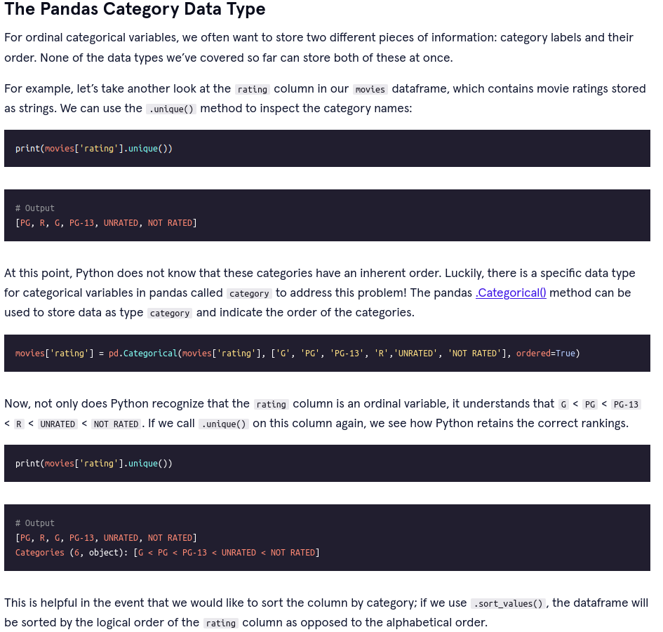

[Series](https://github.com/antonio-datahack/pandas/blob/main/notebooks/Series.ipynb)

1. Create A Series Object from A Python List
2. Create A Series Object from a Dictionary
3. Intro to Attributes
4. Intro to Methods
5. Parameters and Arguments
6. Import Series with the read_csv Method
7. The .head() and .tail() Methods
8. Python Built-In Functions
9. More Series Attributes
10. The .sort_values() Method
11. The inplace Parameter
12. The .sort_index() Method
13. Python's in Keyword
14. Extract Values by Index Position
15. Extract Values by Index Label
16. The .get() Method on a Series
17. Math Methods on Series Objects
18. The .idxmax() and .idxmin() Methods
19. The .value_counts() Method
20. The .map() Method

[DataFrame 1](https://github.com/antonio-datahack/pandas/blob/main/notebooks/DataFrames%201.ipynb)

1. Shared Methods and Attributes
2. Select One Column from a DataFrame
3. Select Two or More Columns from A DataFrame
4. Add New Column to DataFrame
5. Broadcasting Operations
6. A Review of the .value_counts() Method
7. Drop Rows with Null Values
8. Fill in Null Values with the .fillna() Method
9. The .astype() Method
10. Sort a DataFrame with the .sort_values() Method, Part I
11. Sort a DataFrame with the .sort_values() Method, Part II
12. Sort DataFrame with the .sort_index() Method
13. Rank Values with the .rank() Method](#section13)

[DataFrame 2](https://github.com/antonio-datahack/pandas/blob/main/notebooks/DataFrames%202.ipynb)

1. Filter A DataFrame Based On A Condition
2. Filter with More than One Condition (AND)
3. Filter with More than One Condition (OR)
4. The .isin() Method
5. The .isnull() and .notnull() Methods
6. The .between() Method
7. The .duplicated() Method
8. The .drop_duplicates() Method
9. The .unique() and .nunique() Methods

[DataFrame 3](https://github.com/antonio-datahack/pandas/blob/main/notebooks/DataFrames%203.ipynb)

1. The .set_index() and .reset_index() Methods
2. Retrieve Rows by Index Label with .loc[]
3. Retrieve Row(s) by Index Position with iloc
4. The Catch-All .ix[] Method
5. Set New Values for a Specific Cell or Row
6. Set Multiple Values in DataFrame¶
7. Rename Index Labels or Columns in a DataFrame
8. Delete Rows or Columns from a DataFrame
9. Create Random Sample
10. The .nsmallest() and .nlargest() Methods
11. Filtering with the where Method
12. The .query() Method
13. A Review of the .apply() Method on Single Columns¶
14. The .apply() Method with Row Values
15. The .copy() Method

[Working with Text Data](https://github.com/antonio-datahack/pandas/blob/main/notebooks/Working%20with%20Text%20Data.ipynb)

1. Common String Method - .lower(), .upper(), .title(), .len()
2. The .str.replace() Method
3. Filterig With String Methods
4. More String Methods - .strip(), .lstrip(), and .rstrip()
5. Invoke String Methods on DataFrame Index and Columns
6. Split Strings by Characters with the str.split Method
7. More Practice with Splits
8. Exploring the expand and n Parameters of the str.split Method

[MultiIndex](https://github.com/antonio-datahack/pandas/blob/main/notebooks/MultiIndex.ipynb)

1. Create A MultiIndex with the .set_index() Method
2. The .get_level_values() Method
3. Change Index Level Name with the set_names Method
4. Extract Rows from a MultiIndex DataFrame
5. The .transpose() Method
6. The .swaplevel() Method
7. The .sort_index() Method on a MultiIndex DataFrame
8. The .stack() Method
9. The .unstack() Method
  * The .unstack() Method, Part 1
  * The .unstack() Method, Part 2
  * The .unstack() Method, Part 3
10. The pivot Method
11. The pivot_table() Method
12. The pd.melt() Method

[Groupby](https://github.com/antonio-datahack/pandas/blob/main/notebooks/Groupby.ipynb)

1. Intro to the Groupby Module
2. The .groupby() Method
3. Retrieve A Group with the .get_group() Method
4. Methods on the Groupby Object and DataFrame Columns
5. Grouping by Multiple Columns
6. The .agg() Method --########--
7. Iterating through Groups

[Merging, Joining and Concatenating](https://github.com/antonio-datahack/pandas/blob/main/notebooks/Merging%2C%20Joining%20and%20Concatenating.ipynb)

1. The pd.concat() Method, Part 1
2. The pd.concat() Method, Part 2
3. The .append() Method
4. Inner Joins, Part 1
5. Inner Joins, Part 2
6. Outer Joins
7. Left Joins
8. The left_on and right_on Parameters
9. Merging by Indexes with the left_index and right_index Parameters
10. The .join() Method
11. The pd.merge() Method

### Annex

[13 Most Important Pandas Functions for Data Science](https://www.analyticsvidhya.com/blog/2021/05/pandas-functions-13-most-important/)

#### The Pandas Category Data Type

